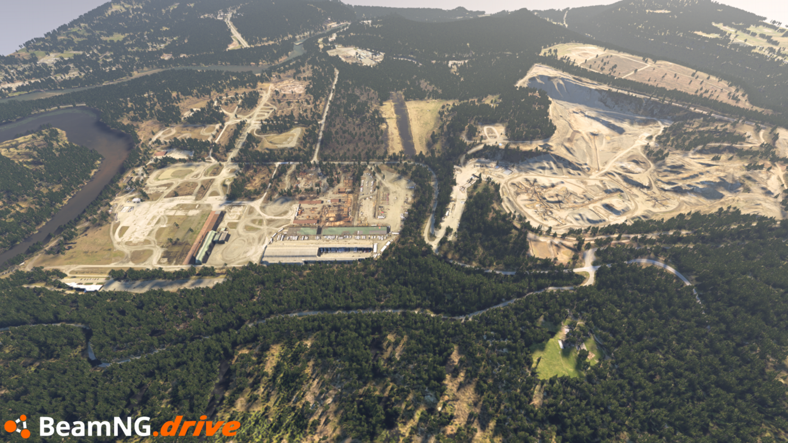
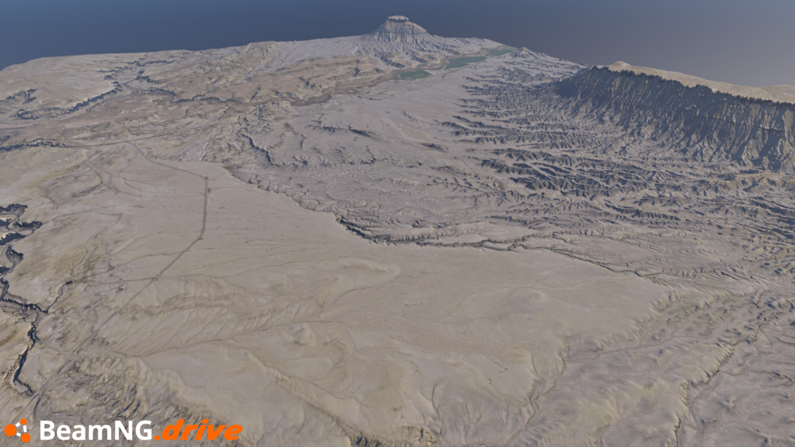
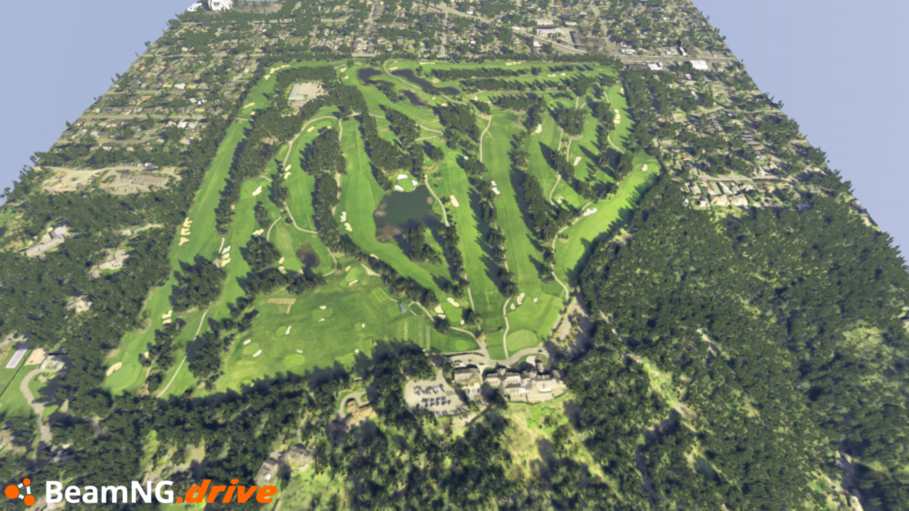
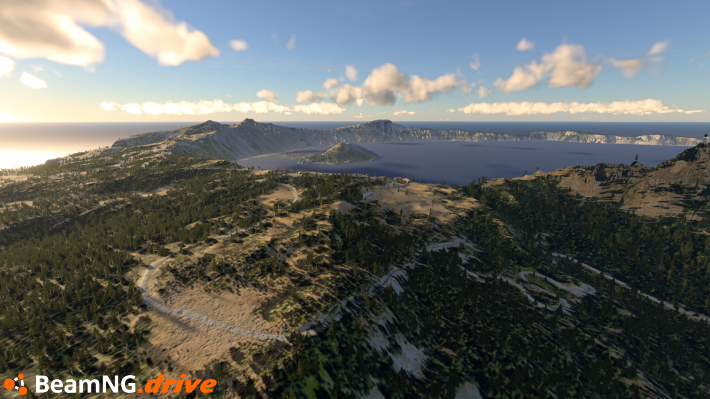
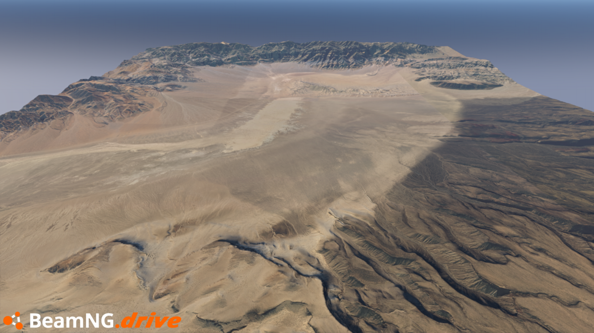
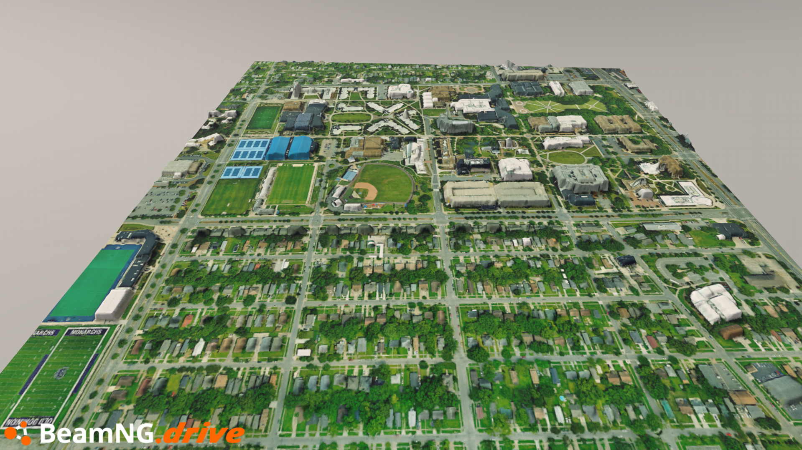

## LiDAR-to-Heightmap Beginner Tutorial

A beginner-friendly, reproducible workflow for turning **LiDAR data into heightmaps, basemaps, and tree placement maps for BeamNG.drive**.

- Additional screenshots and download links for maps can be found [**here**](07_credits_and_resources/01-downloads-and-more-examples.md).

<br>

[**View the full tutorial website**](https://kingstu90.github.io/LiDAR-to-Heightmap-Tutorial-Website/) →

<br>

[**Start the tutorial**](01_tutorial/01-downloading-point-cloud-data.md) →

<br>

<table>
  <thead>
    <tr>
      <th colspan="2" style="text-align: center;">Examples: In-Game Screenshots</th>
    </tr>
  </thead>
  <tbody>
    <tr>
      <td style="text-align: center; width: 50%;">
        
        <br><em>DirtFish Rally School, WA</em>
      </td>
      <td style="text-align: center; width: 50%;">
        
        <br><em>Swing Arm City, UT</em>
      </td>
    </tr>
    <tr>
      <td style="text-align: center; width: 50%;">
        
        <br><em>Seattle Golf Club, WA</em>
      </td>
      <td style="text-align: center; width: 50%;">
        
        <br><em>Crater Lake, OR</em>
      </td>
    </tr>
    <tr>
      <td style="text-align: center; width: 50%;">
        
        <br><em>Eureka Dunes, CA</em>
      </td>
      <td style="text-align: center; width: 50%;">
        
        <br><em>Old Dominion University, VA</em>
      </td>
    </tr>
  </tbody>
</table>

***

### What This Tutorial Does

This tutorial shows you how to turn LiDAR point-cloud data into **heightmaps, basemaps, and tree placement maps that can serve as a starting point for creating a BeamNG.drive map**.

The workflow covers:

- Downloading LiDAR point-cloud data
- Downloading and reprojecting aerial imagery
- Colorizing point clouds
- Cleaning and filtering point-cloud data
- Creating and processing heightmaps
- Creating basemaps from colorized point-cloud data
- Extracting tree locations for use with the BeamNG Biome Tool

The tutorial is designed for beginners and introduces the GIS and LiDAR concepts needed along the way.

***

### Reproducible Workflow

The repository contains the complete project files used by the tutorial, including:

- Step-by-step tutorial notes
- Processing scripts for each stage of the workflow
- `downloadlist.txt` containing links to the source data used in the tutorial
- Native execution commands
- Docker execution commands

You can follow the tutorial using the included `downloadlist.txt` to reproduce the examples, or use the same workflow with your own data. *Depending on the dataset, some steps or settings may need to be adjusted.*

<br>

>[!NOTE]
>**Point cloud** in this tutorial refers to `.laz` or `.las` files.
>
>**Imagery** or **raster** refers to `.tif`, `.tiff`, or `.geotiff` files.

<br>

<div align="center">
  
</div>

***

### Requirements

>[!IMPORTANT]
>All of the steps in the tutorial provide a “**Native Execution**” command which **requires the user to have the program used by that step installed on their PC**.
>
>There is also a “**Docker Execution**” command which requires **Docker**. The advantage of using Docker is that the programs and dependencies used by the Docker workflow are installed in a self-contained environment, **so you don’t have to install and configure each program separately**.

<br>

### Native Execution

All of the software used in the tutorial is listed below and is free to download.

- [**CloudCompare**](https://www.cloudcompare.org/) (*Required*) - 3D point cloud and mesh analysis tool 

- [**PDAL**](https://pdal.io/) (*Required*) - Point cloud processing and translation software

- [**GDAL**](https://gdal.org/en/stable/download.html) (*Required*) - Geospatial raster and vector data library

- [**Miniconda**](https://docs.conda.io/projects/conda/en/latest/user-guide/install/index.html) (*Highly Recommended)* - Recommended package manager for installing PDAL, GDAL, and their dependencies 

- [**QGIS**](https://www.qgis.org/download/) (*Recommended*) - Desktop GIS and mapping software

- [**GIMP**](https://www.gimp.org/downloads/) - (*Highly Recommended*) - Image editor 

- [**LAStools**](https://rapidlasso.de/downloads/) (*Optional*) - LiDAR processing software with a mix of **free and paid tools**. Alternative method for merging large datasets

- [**Obsidian**](https://obsidian.md/download) - (*Optional*) - Note-taking app, good for storing notes and code 

*Depending on your operating system and what dependencies are installed, you may need to do some troubleshooting to get all the programs working correctly*.

<br>

### Docker Execution

*The Docker workflow is primarily intended for Linux users. Docker Desktop can run Linux containers on Windows using WSL 2, but this tutorial does not currently provide Windows-specific Docker instructions or test the Docker workflow on Windows.*

<br>

If you want to use the Docker workflow, install Docker first:
[**Download Docker**](https://www.docker.com/get-started/)

<br>

After installing Docker, build the image from the project directory:

```bash
docker build -t lidar-pipeline .
```

<br>

Then make the pipeline script executable:

```bash
chmod +x run_pipeline.sh
```

<br>

Individual processing scripts can then be run through Docker:

```bash
./run_pipeline.sh 01_download.sh
```

<br>

>[!NOTE]
>To run the 'Docker Execution' commands **with your own project data**, edit the `.sh` text files found in the `03_scripts` directory.

***

### Repository Structure

```text
01_tutorial/                 Step-by-step tutorial notes
02_data/                     Project data
03_scripts/                  Processing scripts
04_resources/                Download list and supporting resources
05_library/                  Additional tools and workflows
06_photos/                   Tutorial images
07_credits_and_resources/    Map download links, attributions, and additional resources

run_pipeline.sh              Docker execution wrapper
dockerfile                   Docker environment
```

***

### Start the Tutorial

[**Step 1: Downloading LiDAR Data**](01_tutorial/01-downloading-point-cloud-data.md) →

***

### Map Downloads & More Examples 

[**Final Results**](07_credits_and_resources/01-downloads-and-more-examples.md) →

### LiDAR Data and Other Resources

[**Useful Resources**](07_credits_and_resources/02-lidar-data-and-other-resources.md) →

### Citations and Attribution

[**Sources**](07_credits_and_resources/03-citations-and-attribution.md) →

***

### Feedback & Support

If you find an issue with the tutorial, have a question, or have feedback on the workflow, I'd be happy to hear from you at <b>kingstuart75@gmail.com</b>.

*Please don't send file attachments. I can't guarantee that I will open files or links sent by email*.

If the tutorial helped you out and you'd like to support the project, the easiest way is to **share the link** with someone who might find it useful. You can also [**buy me a coffee**](https://buymeacoffee.com/stuartking).

### License

This project is licensed under the MIT License. See `LICENSE` for details.

***
